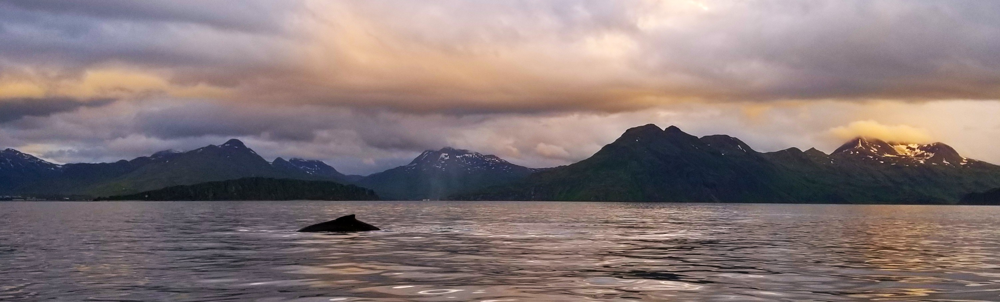

::: {=html}
<link rel="stylesheet" href="https://cdn.jsdelivr.net/npm/academicons@1.9.4/css/academicons.min.css">
:::

::: {.column-screen style="padding: 0; margin-top: 0"}
{.banner .banner-compact fig-align="center"}
:::

# Publications

## Peer-Reviewed Publications

::: {#refs}
:::

::: {=html}

:::

## Conference Presentations

### 2026

**16th International Coral Reef Symposium** — Talk

> *Linking habitat complexity to reef function using multi-species size-spectrum models*
>
> <i class="ai ai-map"></i> Auckland, New Zealand

**16th International Coral Reef Symposium** — Talk

> *Time-lagged impacts of lost habitat structure on reef fish communities*
>
> <i class="ai ai-map"></i> Auckland, New Zealand

**16th International Coral Reef Symposium** — Poster

> *MizerReef: an R package to create multi-species size spectrum models for structurally complex habitats*
>
> <i class="ai ai-map"></i> Auckland, New Zealand

### 2024

**AMSA & NZMSS Joint Conference** — Speed Talk

> *Introducing MizerReef: a new tool to support management from degradation to decision-making*
> 
> <i class="ai ai-map"></i> Hobart, Tasmania, Australia
> 
> 🏆 Winner: NZMSS Best Student Speed Talk

### 2023

**NZMSS Annual Conference** — Talk

> *Small-scale habitat complexity preserves ecosystem services on coral reefs*
> 
> <i class="ai ai-map"></i> Wellington, New Zealand

### 2021

**NZMSS Annual Conference** — Talk

> *Refuge and the Reef: is all habitat structure created equal?*
> 
> <i class="ai ai-map"></i> Tauranga, New Zealand

### 2014

**MAA & AMS Joint Meetings** — Poster

> *An Agent-based Model for a Caribbean Coral Reef*
> 
> <i class="ai ai-map"></i> Baltimore, Maryland, USA

**AMS Regional Meeting** — Talk

> *Agent-based Modelling for Caribbean Coral Reef Management*
> 
> <i class="ai ai-map"></i> Atlanta, Georgia, USA

